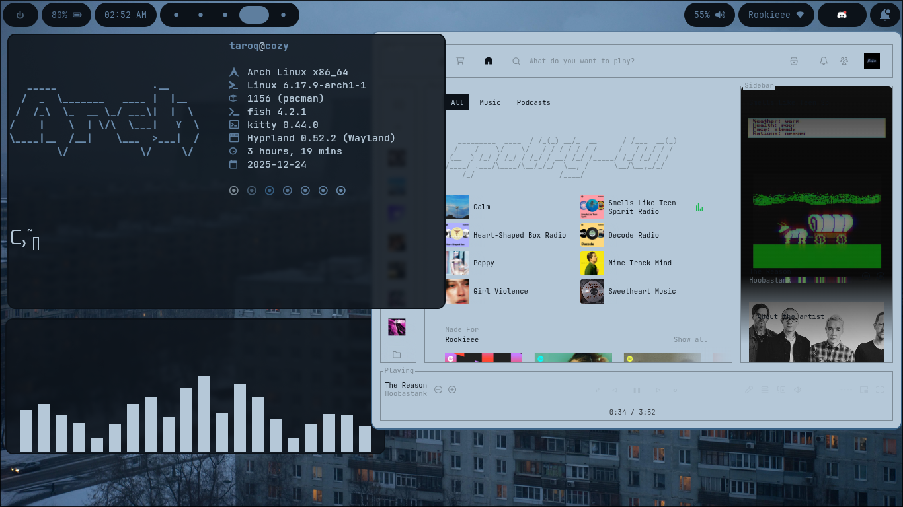

#  Rice 101

A dynamic, automated desktop environment built on **Hyprland**. This setup utilizes **Pywal** to generate color palettes on the fly based on your wallpaper, synchronizing the entire system theme including Discord, Spotify, and Terminal.


## Key Features
- **Dynamic Theming**: All UI colors adapt to your wallpaper using Pywal.
- **Midnight Discord**: Custom SVG icons and Pywal integration for Vencord.
- **Automated Workflow**: Single script to change wallpapers and update all application themes.

## Overview


## 🛠️ Tech Stack
| Component | Tool |
| :--- | :--- |
| **Window Manager** | Hyprland |
| **Status Bar** | Waybar |
| **Terminal** | Kitty |
| **App Launcher** | Rofi |
| **Notifications** | SwayNC |
| **Color Engine** | Pywal |
| **Extensions** | Spicetify, Vencord (Midnight Theme) |

## 🚀 Quick Start

### Installation
Clone the repository and run the installer script to symlink the configurations:

```bash
git clone [https://github.com/Clarity69/dotfiles.git](https://github.com/Clarity69/dotfiles.git)
cd dotfiles
chmod +x install.sh
./install.sh
